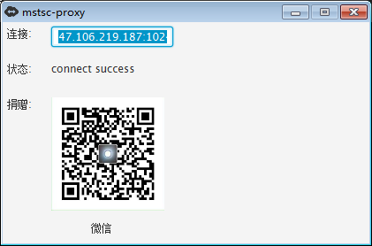
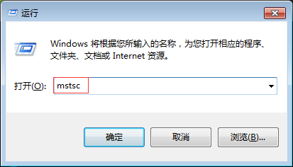

## 用途
这是一个建立远程连接通道的工具，可以在异地连接到公司的内网电脑上。
**适用于有使用windows远程连接经验的用户。**

## 安全风险 
如果使用这个工具，请一定加强Windows登录账户的密码复杂度，以保证不被其他人猜到，进而控制您的内网机器。

## 限制
1. 运行这个程序的电脑（被控端），只支持Windows系统。
2. 被控端需要开启远程桌面协助，但是Win10的Home版不支持这个功能。 

## 优势
与TeamViewer和向日葵软件不同，这个工具只负责建立通道，远程连接时，采用Windows系统自带的rdp协议，使用极少的带宽即可达到非常流畅的效果。

## 使用方法
在被控机器上，**先解压缩**mstsc-proxy-simple.zip，然后双击运行文件夹中的mstsc-proxy.exe，一会儿会出现如下界面（如果按照了安全卫士等软件，可能要等10几秒）。

待界面上的连接码显示为具体的`ipport`后，记录下连接文本框中的文字，在**控制端**的Windows中依次点击开始->运行，输入mstsc，并点击确定按钮：

在计算机那一栏，粘贴刚刚复制的连接串，点击连接后，后续操作与内网使用远程桌面助手一致。

### 备注
    点击程序右上角的关闭按钮，程序不会关闭，而是会隐藏到右下角的图标栏上，要彻底关闭，请在图标上右键->退出程序.

## 原理
默认情况下，内网的机器即使开启了远程，出于NAT的限制，也无法从外网直接连接。这个工具的作用，就是从被控机主动到一台公共的服务器上建立了一条映射通道，那么控制端只要连接到了公共服务器，也就可以间接连接到了内网电脑。

公共服务器是我从阿里云购买的5M带宽服务器，目前仅够使用1个月（至3月1日），如果您可以成功通过这个通道连接到内网机器，可以考虑提供捐赠，捐赠所得将用于拓宽服务器带宽或延迟使用时间。

如果您有自己的自用阿里云服务器，可以修改mstsc-proxy.jar\BOOT-INF\classes\application.properties下的IP、端口、用户名和密码，进一步提高远程连接的安全性。

## 安全性呼吁
目前application.properties中使用的公共服务器的用户名密码，使用的是/sbin/nologin,请不要试图进入公共服务器或者利用本地3389端口发起大流量占用通信通道，谢谢您。

## 源代码
第一版是用javafx做GUI的，需要依赖java8，第二版使用swt为GUI,将各种依赖降低版本至java7,同时在发布包中包含了精简了的jre，压缩后程序包不到15M，可以直接下载，源代码在simple文件夹下。